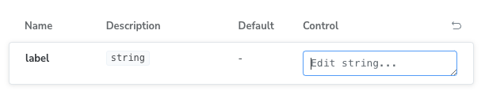
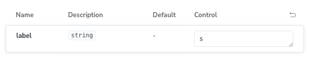

# Subcomponent makes input lose focus
The bug only shows up in the docs page __whenever a subcomponent is defined__. The symptom is that the controls lose focus when they change. In this example I've added a text input called `label` that loses focus whenever you type something in it.
This uses Storybook version: `8.2.9`.

Here's a short visual example:

> Focusing the input


> Typing "s" (see how focus is lost, and we can't type any more characters)


## Testing out the bug

Start up storybook.

```bash
pnpm storybook
```

Then try to alter the `label` control in the `Component` story.

## Reproducible
These are the steps that I've done.

```
* Create Storybook using `pnpm dlx storybook@latest init`
* Add component with text control
* Add any subcomponent

Expected: Text control to work as normal
Actual: Text control loses input whenever something is typed
```
